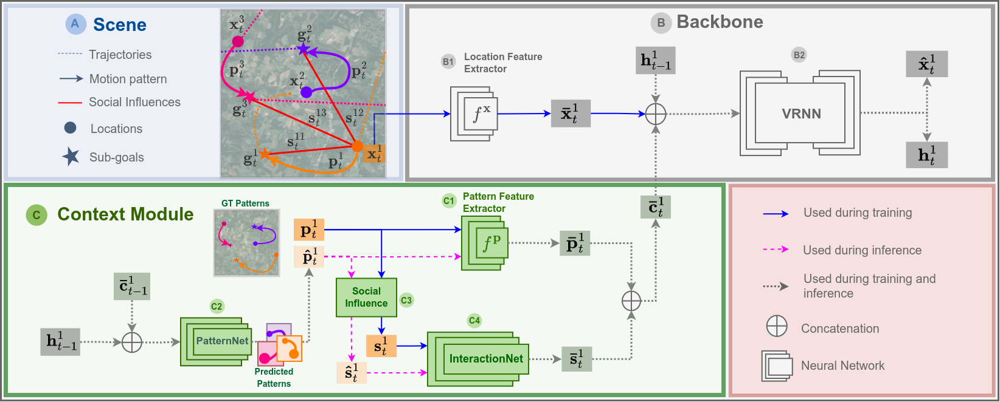

# Social-PatteRNN

This repository contains the code for the paper:

<h4> 
Social-PatteRNN: Socially-Aware Trajectory Prediction Guided by Motion Patterns
</h4>

Ingrid Navarro and [Jean Oh](https://www.cs.cmu.edu/~./jeanoh/) 

<p align="center">
  
</p>

## Model Overview

Social-PatteRNN is an algorithm for recurrent, multi-modal trajectory prediction 
in multi-agent settings. Our approach guides long-term trajectory prediction by 
learning to predict short-term motion patterns. It then extracts sub-goal 
information from the patterns and aggregates it as social context.
<p align="center">
  
</p>

#### Note:
This version of the code now supports context information. 

## Installation

Setup a conda environment:
```
conda create --name sprnn python=3.7
conda activate sprnn
```

Download the repository and install requirements:
```
git clone --branch sprnn git@github.com:cmubig/social-patternn.git
cd social-patternn
pip install -e . 
```

## Dataset

We have tested our algorithm on three different datasets:
- TrajAir (111days)

We provide instructions and the dataloaders to setup the data 
[here](https://github.com/cmubig/social-patternn/tree/sprnn/data).

## Running the code

This repository provides four baselines:
- ```VRNN```: a Recurrent C-VAE for trajectory prediction
- ```PATTERNN```: a VRNN with a context module for pattern learning 
- ```SOCPATTERNN-MLP```: a VRNN with a context module for pattern learning and interaction encoding 
- ```SOCPATTERNN-MHA```: the full model; a VRNN with a context module for pattern learning and interaction encoding with multi-head attention

All of the parameters related to the trajectory specifications, training 
details and model architectures are provided in the configuration files of each 
baseline and experiment. These configuration files can be found in 
```social-patternn/config/dataset-name```.

The ```run.py``` script controls the training, validation and testing for all 
experiments and datasets. An experiment is specified with the flag ```--exp-config```, 
and the type of process is specified with the flag ```--run-type```:
```
python run.py --exp-config path/to/exp-config.json --run-type [trainval | train | eval | test]
```

#### Running the SocialPatteRNN model

For example, to train and validate the SocialPatteRNN model on the 111days dataset, execute:
```
python run.py --exp config/111days/socpatternn-mha.json
```

To test a trained model, run:
```
python run.py --exp config/111days/socpatternn-mha.json --run test --best
```

To test or evaluate one of a specific checkpoint, you can specify the checkpoint 
number ```ckpt_num``` if the checkpoint is in the default path or the checkpoint 
path ```ckpt_path``` if not. 

Example with checkpoint number which would load ```ckpt_10.pth```:
```
python run.py --exp config/111days/socpatternn-mha.json --run test --ckpt_num 10
``` 

For each experiment, we provide the configuration files for all the ablations 
performed in our paper. They are organized as follows:
```
config/
├─ 111days
|   ├─ base_config.json        
|   ├─ vrnn.json
|   ├─ patternn.json
|   ├─ socpatternn_mlp.json
|   ├─ socpatternn_mha.json
|   ├─ ...
├─ ...
```

## TODO: add results, checkpoints and reference

#### TODO: update this
```tex
@inproceedings{name,
  title={Paper},
  author={Author1 and Author2},
  booktitle={Conference},
  year={2022}
 }
```